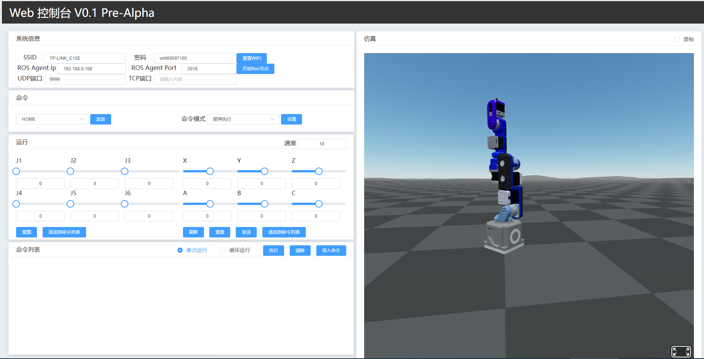
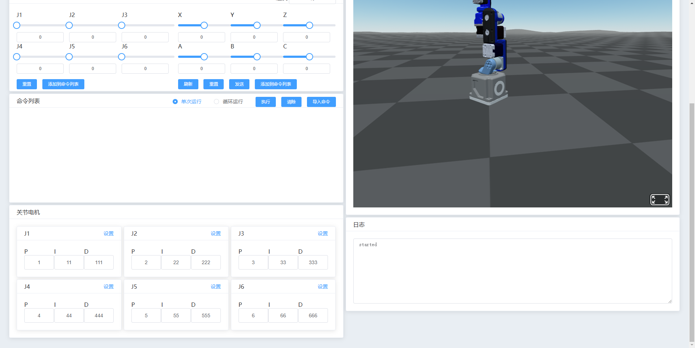
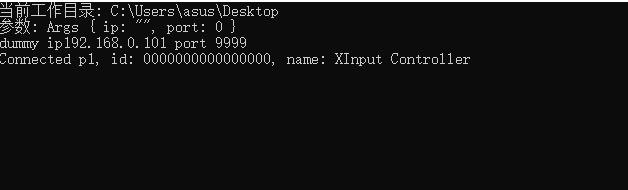
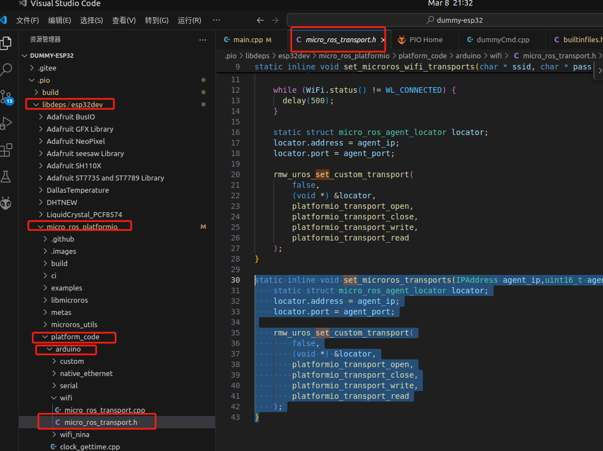

# DummyEsp32

#### 介绍
这个项目用于[稚晖的dummy-root](https://github.com/peng-zhihui/Dummy-Robot)中的esp32芯片.   
电机和ref版的固件是基于[木子](https://gitee.com/switchpi/dummy)版进行了修改。   
开发环境是vscode+platformIO.如果不用ros的功能，可以在windows下开发（将platfromio.ini中的lib_deps = 
      https://github.com/micro-ROS/micro_ros_platformio去掉，然后删除掉ros部分的代码即可)。
如果使用ros，需要在linux下开发编译。
使用vue和element ui开发的前端界面。3D框架使用了aframe,如果使用nginx自己配置一个https。还可以投到VR头盔中。  
模型使用的是[Arthur.zhu大佬](https://www.bilibili.com/video/BV1Gy421h7MS/?spm_id_from=333.337.search-card.all.click&vd_source=37f58ab2bcacdba59a23cce992e5fa17)开源的V2版本
#### 截图




#### 功能

1.  Dummy IP地址显示：Dummy上电后，没设置wifi时。ESP32会处于AP模式，用手机或电脑可搜索到名称为DummyEsp32的热点，然后在浏览器中输入Dummy屏幕上显示的ip地址，可打开wifi设置页面。输入wifi的帐号和密码后，Dummy会自动重启并连接到设置的wifi。屏幕上会显示会sta模式和dummy的ip地址。在浏览器中输入ip地址，即可打开控制台界面。
2.  实现了简单的示教功能。
3.  实现了PID的设置功能。
4.  实现了姿态的实时显示功能。
5.  集成了microros库，利用esp32的wifi能力，可实现无线与ros2系统对接。  
6.  实现了手柄控制


#### 使用说明

1.  UI的代码在builtinfiles.h文件中，模型文件目前是在七牛云，你也可以自己配置个nginx放在本地。
2.  手柄的驱动在joystick文件夹中，先将config.toml配置文件中的ip改为dummy的ip然后运行joystick.exe,然后连接手柄，如下图，表示手柄连接成功
   
手柄按键映射   

| 手柄 | Dummy |
| ---- | ---- |
| MenuL | Home |
| MenuR | Reset |
| X | Start|
| Y | Stop|
|JoyX| J1|
|JoyY| J2|
其它的看代码吧

#### 重要说明
如果是在linux下编译，使用了ros2功能。
1、microros库里的set_microros_transports函数，与本项目的wifi功能有冲突。所以我单独写了一个set_microros_transports函数。代码如下：
```c++
static inline void set_microros_transports(IPAddress agent_ip,uint16_t agent_port){
    static struct micro_ros_agent_locator locator;
    locator.address = agent_ip;
    locator.port = agent_port;

    rmw_uros_set_custom_transport(
        false,
        (void *) &locator,
        platformio_transport_open,
        platformio_transport_close,
        platformio_transport_write,
        platformio_transport_read
    );
}
```
将这段代码放到下图的位置中即可


2、ref和42、35电机的固件，我是在windows下编译的。

#### 技术交流
如有问题欢迎加群讨论：QQ群:651268948
